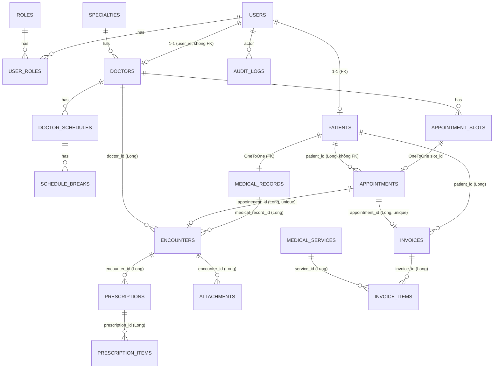

# MedBook — Tài liệu dự án (bản đọc hiểu code, 30/09/2026)

> Hệ thống quản lý bệnh án và đặt lịch khám — CSE702051, Nhóm 03.
> Tài liệu này tổng hợp từ: (1) *Phân công 5 dev*, (2) *Báo cáo buổi 2* (25 YCCN, 15 YCPCN, 7 UC), và (3) **đọc trực tiếp mã nguồn nhánh `develop` + thay đổi chưa commit trong working tree**.
> Bộ prompt tạo chức năng đi kèm: [PROMPTS_PHAT_TRIEN_BE_FE.md](PROMPTS_PHAT_TRIEN_BE_FE.md).

**Quy ước đường dẫn:** `BE/` = `src/main/java/com/phenikaa/cse702051/medbook/`; `FE/` = `frontend/src/`. Số sau dấu `:` là số dòng tại thời điểm viết.

**Mức độ tin cậy của các nhận định:**

| Nhãn | Nghĩa |
|---|---|
| **[Đã chạy]** | Đã thực thi và quan sát kết quả. **Đính chính (30/09, sau khi build sạch):** bản `develop` `6eabc95` **không compile được** — `AppointmentSlotController` gọi `AppointmentSlotService.getAvailableSlots` nhưng service là lớp rỗng. Lần "compile đạt" trước đó là do Maven dùng lại `target/` cũ nên không đáng tin. Đã sửa ở nhánh `feature/medbook-full`; sau sửa, build sạch + toàn bộ test đạt |
| **[Đọc code]** | Suy ra từ đọc mã nguồn, **chưa** chạy API thật. Cần viết test để xác nhận trước khi sửa |

---

## 0. Tóm tắt nhanh

1. **Git:** các nhánh cần gộp (`develop`, `feature/dev4-final`, `feature/v1-medical-record-access`, `feature/v2-data-access`, `feature/v3-business-layer`, `feature/v4-security`) **đều đã nằm trong `develop`** (0 commit chưa gộp). `main` và `khanh-dev` bị loại theo yêu cầu. Xem mục 1.
2. **Backend** đã có khung 3 tầng, 20 thực thể, JWT + BCrypt(12), đặt lịch chống trùng bằng `@Version`, khám/đơn thuốc/hóa đơn/tệp. Nhưng **các module chưa nối với nhau**: mỗi dev dựng cơ chế "người dùng hiện tại" riêng, nên nhiều API sẽ không chạy đúng với JWT thật (mục 11, lỗi P0).
3. **Phần còn thiếu lớn:** quản trị tài khoản/role, khóa đăng nhập sai, đăng xuất thật, quên mật khẩu, CRUD danh mục (chuyên khoa/dịch vụ/thuốc), lịch làm việc bác sĩ, audit log thực sự được ghi, thông báo, báo cáo có bộ lọc, phân trang, OpenAPI, migration, test ≥ 25 ca.
4. **Frontend** (Vue 3 + Vite + Tailwind) mới có 5 view; **gọi sai endpoint** so với backend (mục 9). Cần dựng lại khung theo mục 9 và 13.
5. **Rủi ro bảo mật cần xử lý trước khi làm tính năng mới:** header giả danh `X-MedBook-*`, route `/api/v1/**` không được gán role, đặt/hủy lịch nhận `patientId` từ request, bệnh nhân tự đánh dấu "đã thanh toán" (mục 11).

---

## 1. Kết quả kéo và gộp nhánh git

Thực hiện ngày 30/09/2026: `git fetch --all --prune`, sau đó so sánh từng nhánh với `develop`.

| Nhánh remote | Commit chưa có trong `develop` | Ghi chú |
|---|---|---|
| `origin/develop` | 0 | trùng local `develop` (`605ef52`) |
| `origin/feature/dev4-final` | 0 | encounter/đơn thuốc — đã gộp |
| `origin/feature/v1-medical-record-access` | 0 | truy cập bệnh án — đã gộp |
| `origin/feature/v2-data-access` | 0 | data access + metrics — đã gộp |
| `origin/feature/v3-business-layer` | 0 | appointment/schedule/doctor — đã gộp |
| `origin/feature/v4-security` | 0 | đăng ký/đăng nhập BCrypt — đã gộp |
| `origin/main` | 9 | **bỏ qua theo yêu cầu** |
| `origin/khanh-dev` | 8 | **bỏ qua theo yêu cầu** |

→ Không có gì để merge. Lệnh fetch chỉ cập nhật `main` và thêm `khanh-dev`. Không có commit, reset hay checkout nào được thực hiện; 45 file bạn đang sửa dở giữ nguyên.

**Vì sao nên tiếp tục bỏ `main` và `khanh-dev`:** 9 commit của `main` và 8 commit của `khanh-dev` do `vuongkhanh897-oss` tạo trong ngày 30/09 gồm `server.js`, `package.json`, `public/{index.html,app.js,style.css}` (một app Node/Express riêng), đổi tên `Dockerfile` → `Dockerfile.bak` và thay `.gitignore`. Gộp vào sẽ làm hỏng Docker build của Spring Boot.

**Trạng thái working tree (chưa commit) — cần biết vì đây là code thật đang chạy:**

- 38 file sửa + untracked: `frontend/`, `config/JwtAuthenticationFilter.java`, `config/JwtUtil.java`, `resources/data.sql`, `resources/static/assets/*`.
- Nội dung chính: bật JWT thật trong `SecurityConfig` (bản đã commit là `anyRequest().permitAll()` — **mở toàn bộ API**), chuyển mọi controller sang tiền tố `/api/v1`, viết lại `MedicalRecordService` dùng `SecurityContext` thay cho token giả, thêm H2 + `data.sql`, thêm frontend.
- **Nên commit sớm** (ví dụ nhánh `feature/jwt-frontend-bootstrap`) trước khi bất kỳ ai `pull`/`merge` để không mất công.
- Còn 2 mục `git stash` (`Auto-stash: Save uncommitted changes before migration` và `WIP on develop: 72d71ab`) và nhánh local `appmod/java-upgrade-20260929082501` (kế hoạch nâng Java 25, cùng commit với `develop`). Đừng `stash drop` khi chưa xem nội dung.
- `docs/` nằm trong `.gitignore` (commit `8904403` "Stop tracking project docs"). Tài liệu trong thư mục này **không được đẩy lên GitHub**; muốn chia sẻ cho nhóm dùng `git add -f docs/<file>` hoặc chuyển sang thư mục khác.

---

## 2. Bối cảnh, vai trò, phạm vi

**Đề tài DT03:** hệ thống web mô phỏng quản lý bệnh án và đặt lịch khám. Dữ liệu **chỉ là dữ liệu giả lập**.

| Vai trò | Mục tiêu | Phạm vi dữ liệu |
|---|---|---|
| **PATIENT** | Tìm bác sĩ, đặt/hủy/đổi lịch, xem lịch sử khám, bệnh án, đơn thuốc, tệp, hóa đơn | Chỉ dữ liệu của chính mình |
| **DOCTOR** | Lịch làm việc, xem lịch khám, khám, ghi bệnh án, kê đơn, tải tệp, lập hóa đơn | Bệnh nhân thuộc phạm vi phụ trách |
| **ADMIN** | Tài khoản, bác sĩ, danh mục, theo dõi lịch/hóa đơn, báo cáo, audit log | Dữ liệu hành chính. **Không mặc nhiên đọc nội dung bệnh án** |

**Ba đặc trưng bắt buộc của đề tài:** (1) chống đặt trùng slot khi đồng thời, (2) phân quyền bệnh án tới từng bản ghi, (3) audit mọi lần xem bệnh án.

**Không làm:** lễ tân/điều dưỡng, thanh toán thực tế/cổng thanh toán, bảo hiểm y tế, nhà thuốc đầy đủ, video call, chẩn đoán AI, thiết bị xét nghiệm, chữ ký số, đồng bộ bệnh viện, nội trú, cấp cứu.

**Luồng trình diễn cần chạy được:** bác sĩ tạo lịch → sinh slot → bệnh nhân tìm bác sĩ → đặt lịch → bác sĩ xem lịch → khám → ghi bệnh án → kê đơn → hoàn thành → bệnh nhân xem lịch sử khám. Song song: Admin quản lý tài khoản/danh mục, xem báo cáo, tra audit log.

---

## 3. Phân công và ranh giới module

| Dev | Backend sở hữu | Frontend | API bàn giao chính |
|---|---|---|---|
| **Dev 1** | `User, Role, UserRole`, `AuthService`, `UserService`, `SecurityConfig`, JWT filter, đặt lại mật khẩu, quản lý phiên | **Khu Admin** | `/auth/*`, `/users/me`, `/admin/users/**` |
| **Dev 2 (leader)** | `Patient, MedicalRecord, AuditLog, Specialty, MedicalService, Medicine` | Hỗ trợ | `/patients/**`, `/medical-records/**`, `/specialties`, `/medical-services`, `/medicines`, `/admin/{specialties,medical-services,medicines,audit-logs}` |
| **Dev 3** | `Doctor, DoctorSchedule, ScheduleBreak, AppointmentSlot, Appointment`, `NotificationService`, `AppointmentReportService` | Hỗ trợ | `/doctors/**`, `/admin/doctors/**`, `/doctor-schedules/**`, `/appointments/**`, `/admin/appointments`, `/admin/reports/appointments` |
| **Dev 4** | `Encounter, Prescription, PrescriptionItem, Invoice, InvoiceItem, Attachment`, `InvoiceReportService` | Hỗ trợ | `/encounters/**`, `/prescriptions/**`, `/attachments/**`, `/invoices/**`, `/admin/invoices`, `/admin/reports/revenue` |
| **Dev 5** | — | **Khung chung + khu Bệnh nhân + khu Bác sĩ**, component chung, API client, trang 403/404 | dùng API của Dev 1–4 |

**Điểm nối giữa module (phải thống nhất contract):**

| Điểm nối | Chủ | Cách phối hợp |
|---|---|---|
| Tài khoản → hồ sơ bệnh nhân/bác sĩ | Dev 1 điều phối | Gọi `PatientService` (Dev 2) và `DoctorService` (Dev 3) trong **một transaction**; lỗi thì rollback, không để tài khoản mồ côi |
| Danh mục → lịch/đơn | Dev 2 | Dev 3/4 chỉ dùng qua service của Dev 2 |
| Lịch hẹn → lần khám | Dev 3 | Dev 4 gọi service của Dev 3 để kiểm quyền và đổi trạng thái |
| Lần khám → bệnh án | Dev 4 điều phối | Nội dung bệnh án lưu qua `MedicalRecordService` (Dev 2) |
| Audit | Dev 2 cung cấp | Mọi dev gọi `AuditLogService` khi có sự kiện nhạy cảm |
| Thông báo | Dev 3 | Gửi sau commit |
| Báo cáo | Dev 3 (lịch), Dev 4 (hóa đơn) | Dev 1 dựng màn hình Admin |

Nguyên tắc: không tự sửa entity/service/controller của người khác; đổi DTO/schema phải báo trước khi merge; mọi PR phải build + chạy test liên quan; Dev 2 rà soát/merge.

---

## 4. Công nghệ và cấu trúc thư mục

| Thành phần | Thực tế trong repo |
|---|---|
| Java / Spring Boot | Java 21, Spring Boot **4.1.1** (`pom.xml`), Maven Wrapper 3.9.16 |
| Web/Security | `spring-boot-starter-web`, `-security`, `-validation`; JWT `jjwt 0.12.6` (HS256) |
| Dữ liệu | Spring Data JPA/Hibernate; **H2 in-memory** (profile mặc định), **MySQL 8** (profile `docker`); Flyway đã khai báo dependency nhưng **đang tắt** (`application.yaml:26`) |
| Tiện ích | Lombok (một số entity Dev 4 viết getter/setter tay) |
| Frontend | Vue 3.5, Vue Router 5 (hash history), axios, Tailwind 4 (qua `@tailwindcss/postcss`), Vite 8; Font Awesome qua CDN |
| Đóng gói | `Dockerfile` (multi-stage Maven → JRE 21), `docker-compose.yml` (MySQL 8 + app; phpMyAdmin ở profile `database`) |

```
medbook/
├─ pom.xml, Dockerfile, docker-compose.yml, .env.example
├─ src/main/java/.../medbook/
│   ├─ config/      SecurityConfig, JwtUtil, JwtAuthenticationFilter
│   ├─ security/    CurrentUser (record), CurrentUserService
│   ├─ controller/  23 controller (8 cái còn rỗng: Role, User, UserRole, Specialty, MedicalService, Medicine, DoctorSchedule, ScheduleBreak)
│   ├─ service/     27 service
│   ├─ repository/  Spring Data + DataMetrics/SystemStatus repo
│   ├─ model/       22 file (entity + enum + UserRoleId)
│   ├─ dto/         Auth, Patient, MedicalRecord, AuditLog, ... (chưa đủ)
│   └─ exception/   ApiError, ApiException(+5 lớp con), ErrorCode, GlobalExceptionHandler
├─ src/main/resources/
│   ├─ application.yaml (H2, JWT, multipart 10MB), application-docker.yml (MySQL)
│   ├─ data.sql     seed cho H2
│   └─ static/      bản build frontend (index.html + assets/*, có 3 bản JS/CSS băm cũ)
├─ src/test/        AppointmentConcurrencyTest (mock), MedbookApplicationTests
├─ frontend/        Vue 3 + Vite (dist/ và node_modules/ bị gitignore)
└─ docs/            (gitignored) schema.sql, seed*.sql, ERD.mmd, data_dictionary.md, v3-api-endpoints.md, openapi.yaml, postman
```

Ghi chú: 8 controller rỗng đúng là `Role, User, UserRole, Specialty, MedicalService, Medicine, DoctorSchedule, ScheduleBreak` (chỉ có `@RequestMapping`, không có endpoint).

---

## 5. Kiến trúc backend

### 5.1 Ba tầng

`Controller → Service → Repository` (theo `docs/QUY_UOC_MA_NGUON.md`). Quy ước: controller không gọi repository; service ném `ApiException` con (`BadRequestException`, `ResourceNotFoundException`, `ConflictException`, `ForbiddenException`, `UnauthorizedException`); `GlobalExceptionHandler` chuyển thành JSON `ApiError`:

```json
{ "timestamp": "...", "status": 400, "error": "Bad Request", "code": "VALIDATION_FAILED",
  "message": "...", "path": "/api/v1/...", "details": { "field": "lý do" } }
```

**Thực tế lệch quy ước:** rất nhiều service (Dev 4) ném `IllegalArgumentException` cho cả lỗi quyền lẫn "không tìm thấy". `GlobalExceptionHandler` map `IllegalArgumentException` → **400**, nên truy cập trái quyền trả 400 thay vì 403/404 (mục 11).

### 5.2 Xác thực và phân quyền hiện tại

```
Client ──POST /api/v1/auth/login──▶ AuthService.login
   ◀── {token(HS256, 24h, claims: userId, roles), userId, roles, patientId, doctorId, ...}
Client ── Authorization: Bearer <jwt> ──▶ JwtAuthenticationFilter
   verify chữ ký + hạn ──▶ SecurityContext: principal = username (String), credentials = userId,
                                            authorities = ROLE_<code>
                        ──▶ SecurityConfig.authorizeHttpRequests(...)
```

- BCrypt cost **12** (`SecurityConfig:36`), đạt yêu cầu ≥ 10. Không trả `passwordHash` trong `LoginResponse`/`RegisterResponse`. Đăng ký luôn gán role `PATIENT` (không nhận role từ client).
- CSRF tắt, session STATELESS, CORS cho `localhost:5173/3000/8080`.
- **Đăng xuất chỉ là stub** (`AuthController.logout` trả 204 nếu có header, không vô hiệu hóa token).
- Chưa có: khóa sau 5 lần sai, kiểm tra lại trạng thái tài khoản mỗi request, thu hồi token, quên/đặt lại mật khẩu, đổi mật khẩu.

### 5.3 Ba cách lấy "người dùng hiện tại" đang cùng tồn tại — nguồn lỗi tích hợp chính

| Cơ chế | Dùng ở | Với JWT thật |
|---|---|---|
| `CurrentUserService` — `parseLong(authentication.getName())` hoặc header `X-MedBook-User-Id` | `PatientService`, `AuditLogService` (Dev 2) | `getName()` là **username** (chuỗi, không phải số) → luôn rỗng → 401 "Chua dang nhap" trừ khi gửi header giả. **[Đọc code]** |
| `authentication.getName()` → `findByUsername` | `Dev4AuthorizationService` (Encounter/Prescription/Invoice/Attachment) | Hoạt động |
| `authentication.getName()` → `patientRepository.findByUserUsername` | `MedicalRecordService` | Hoạt động |
| `appointmentId`, `patientId`, `doctorId` nhận từ `@RequestParam` | `AppointmentController` (Dev 3) | Không dùng danh tính — bất kỳ ai cũng đặt/hủy/đổi hộ người khác |

---

## 6. Mô hình dữ liệu (theo JPA entity, không theo `docs/schema.sql`)



**Bảng thực thể chính (rút gọn):**

| Bảng | Cột đáng chú ý |
|---|---|
| `users` | `username`(uq), `password_hash`, `full_name`, `email`(uq), `phone`, `status` (`ACTIVE`/...), timestamps |
| `roles` / `user_roles` | `code` = `PATIENT`/`DOCTOR`/`ADMIN`; khóa kép `(user_id, role_id)` |
| `patients` | `patient_code`(uq), `date_of_birth`, `gender_code`, `blood_type`, `allergies`, `status`; `user_id` FK unique |
| `doctors` | `user_id`(uq), `specialty_id`, `license_number`, `bio`, `is_active` |
| `specialties`, `services`, `medicines` | `code`(uq), `name`, `status`; `services.price` `DECIMAL(12,2)`, `duration_minutes`; `medicines.unit` |
| `doctor_schedules` | `doctor_id`, `work_date`, `start_time`, `end_time` |
| `schedule_breaks` | `doctor_schedule_id`, `start_time`, `end_time`, `reason` |
| `appointment_slots` | `doctor_id`, `slot_date`, `start/end_time`, `is_available`, `status` (`AVAILABLE`/`BOOKED`/`CANCELLED`), **`version` (@Version)** |
| `appointments` | `patient_id`, `doctor_id`, `slot_id` (OneToOne), `status` (enum `PENDING/CONFIRMED/IN_PROGRESS/COMPLETED/CANCELLED`), `notes`. **Chưa có `service_id`, `cancel_reason`** |
| `medical_records` | `patient_id`(unique — **mỗi bệnh nhân 1 bệnh án**), `record_code`, `chronic_conditions`, `allergy_notes`, `medical_history`, `current_medications` |
| `encounters` | `medical_record_id`, `appointment_id`(uq), `doctor_id`, `chief_complaint`, `diagnosis`, `clinical_notes`, `treatment_plan`, `follow_up_note`, `status` (`OPEN`...) |
| `prescriptions` / `prescription_items` | `prescription_code`(uq), `status` (`ACTIVE`/`CANCELLED`); item có **`medicine_name` (chuỗi), chưa có `medicine_id`** |
| `invoices` / `invoice_items` | `invoice_code`(uq), `subtotal/discount_amount/total_amount` (`DECIMAL`), `status` (`UNPAID`/`PAID`/`VOID`), `issued_at`, `paid_at`; item có `service_id`, `quantity`, `unit_price`, `line_total` |
| `attachments` | `original_file_name`, `stored_file_name`(uq, UUID), `file_path`, `mime_type`, `file_size`, `uploaded_at` |
| `audit_logs` | `actor_user_id`, `action_code`, `entity_type`, `entity_id`, `ip_address`, `user_agent`, `metadata_json`, `created_at` |

**Lệch/rủi ro dữ liệu cần xử lý:**

- Entity Dev 3/4 dùng cột `Long` thuần (`patient_id`, `medical_record_id`, `doctor_id`, `encounter_id`, ...) thay vì `@ManyToOne`. Với `ddl-auto: update` **không có khóa ngoại** cho các cột này → phải bổ sung bằng migration (yêu cầu "khóa ngoại và chỉ mục" của Dev 1–4).
- `docs/schema.sql`, `data_dictionary.md`, `ERD.mmd` mô tả một thiết kế cũ (bảng `schedules`, `services`, `appointments.schedule_id`) **khác** thực thể JPA (`doctor_schedules`, `appointment_slots`, `appointments.slot_id`). Cần chốt một nguồn sự thật (mục 12, D10).
- `Appointment.slot` là `@OneToOne` → Hibernate thường sinh ràng buộc UNIQUE trên `slot_id`. Lịch đã hủy vẫn giữ `slot_id` nên **có thể không đặt lại được slot đã giải phóng** (đúng lỗi mà `docs/README_V2.md §1b` đã mô tả với SQL). **[Đọc code — cần test xác nhận]**.
- Không có `@Table(indexes=...)`; chưa có chỉ mục cho `appointments(patient_id)`, `appointments(doctor_id, status)`, `appointment_slots(doctor_id, slot_date)`, `audit_logs(created_at)`.

---

## 7. Danh mục API

### 7.1 API hiện có trong code (working tree, mọi đường dẫn có tiền tố `/api/v1`)

| Nhóm | Method + đường dẫn | Ghi chú thực trạng |
|---|---|---|
| Auth | `POST /auth/register`, `/auth/login`, `/auth/logout` | logout là stub |
| Hệ thống | `GET /system/status`, `GET /admin/data-metrics` | |
| Bác sĩ | `GET /doctors?specialtyId=`, `GET /doctors/{id}`; `POST /doctors/admin`, `PUT /doctors/admin/{id}`, `DELETE /doctors/admin/{id}` | trả **entity** `Doctor`; đường dẫn admin khác spec (`/admin/doctors`) |
| Slot | `GET /appointment-slots/available?doctorId=&date=` | trả entity; spec là `/doctors/{id}/slots` |
| Lịch hẹn | `POST /appointments` (`patientId,slotId,notes` là **query param**), `PATCH /{id}/cancel?patientId=`, `PATCH /{id}/reschedule?newSlotId=&patientId=`, `PATCH /{id}/status?status=&doctorId=`, `GET /{id}`, `GET /patient/{patientId}`, `GET /doctor/{doctorId}`, `GET /admin/reports`, `GET /admin/reports/doctor/{doctorId}` | sai spec: không dùng JWT, không `/me`, báo cáo nằm trong `/appointments` |
| Bệnh nhân | `GET /patients/me`, `PUT /patients/me` | dùng `CurrentUserService` (không chạy với JWT thật) |
| Bệnh án | `GET /medical-records/{id}`, `POST /medical-records` | POST nhận **entity thô** `MedicalRecord`; chưa có `/me`, `/patients/{id}/medical-records` (service `getMyRecords` có nhưng chưa expose) |
| Audit | `GET /audit-logs?actorUserId=&entityType=&entityId=` | spec là `/admin/audit-logs`; không phân trang; **không có ai ghi log** (mục 8) |
| Lần khám | `POST /encounters`, `GET /encounters/{id}`, `GET /encounters/medical-record/{id}`, `GET /encounters/doctor/{doctorId}`, `PUT /encounters/{id}` | nhận/trả **entity**; client tự gửi `medicalRecordId`, `doctorId` |
| Đơn thuốc | `POST/GET /encounters/{id}/prescriptions`, `GET/PUT /prescriptions/{id}`, `POST/GET /prescriptions/{id}/items`, `GET/PUT/DELETE /prescription-items/{id}`, `GET /prescription-items/search?medicineName=` | item chỉ lưu tên thuốc |
| Tệp | `POST/GET /encounters/{id}/attachments` (multipart `file`), `GET /attachments/{id}/download`, `DELETE /attachments/{id}` | trả entity (lộ `filePath`) |
| Hóa đơn | `POST /encounters/{id}/invoice?discountAmount=` (body: danh sách item), `GET /invoices/me`, `GET /invoices/{id}`, `GET /invoices/{id}/items`, `GET /admin/invoices`, `PUT /invoices/{id}/pay`, `PUT /invoices/{id}/void` | |
| Báo cáo | `GET /admin/reports/revenue?from=&to=` | tính trong bộ nhớ (`findAll`) |
| **Controller rỗng** | `/roles`, `/users`, `/user-roles`, `/specialties`, `/medical-services`, `/medicines`, `/doctor-schedules`, `/schedule-breaks` | chưa có endpoint |

### 7.2 Ba bộ đường dẫn mâu thuẫn — cần chốt một

| Nguồn | Ví dụ | Trạng thái |
|---|---|---|
| **PDF phân công** (chuẩn giao việc) | `/api/appointments/me`, `/api/admin/users`, `/api/admin/doctors`, `/api/doctor-schedules` | không có tiền tố `v1` |
| **`docs/v3-api-endpoints.md`** (cũ) | `/api/v1/public/specialties`, `/api/v1/doctor/schedules`, `/api/v1/patient/appointments`, bọc `{success,data}` | không code nào theo |
| **Code hiện tại** | `/api/v1/appointments/patient/{id}`, `/api/v1/doctors/admin` | đang chạy, lệch PDF |

**Đề xuất (D1):** giữ tiền tố `/api/v1` (đã áp dụng trong code + frontend), **hậu tố theo đúng bảng trong PDF** (ví dụ `/api/v1/appointments/me`, `/api/v1/admin/doctors`). Bỏ `docs/v3-api-endpoints.md` và `docs/openapi.yaml` cũ; sinh OpenAPI tự động bằng springdoc.

### 7.3 Hợp đồng API đề xuất (contract freeze) — mọi endpoint dưới `/api/v1`

Ký hiệu quyền: `P` = công khai, `PT` = PATIENT, `DR` = DOCTOR, `AD` = ADMIN, `*` = mọi người đã đăng nhập. "Page" = `PageResponse<T>`: `{content[], page, size, totalElements, totalPages}`.

**Dev 1 — Auth & tài khoản**

| Endpoint | Quyền | Vào → Ra |
|---|---|---|
| `POST /auth/register` | P | `{username,password,fullName,email,phone,dateOfBirth?,genderCode?,address?}` → 201 `{userId,username,email,fullName,role,patientId,patientCode}` |
| `POST /auth/login` | P | `{usernameOrEmail,password}` → `{token,tokenType,expiresAt,userId,username,email,fullName,roles[],patientId,doctorId}`; sai → 401; khóa → 403 `ACCOUNT_LOCKED` |
| `POST /auth/logout` | * | → 204 (token bị thu hồi) |
| `POST /auth/change-password` | * | `{oldPassword,newPassword}` → 204 |
| `POST /auth/forgot-password` | P | `{email}` → 202 (luôn trả như nhau) |
| `POST /auth/reset-password` | P | `{token,newPassword}` → 204; hết hạn/đã dùng → 400 |
| `GET/PUT /users/me` | * | `UserProfileDTO`; PUT chỉ sửa `fullName,phone,email` |
| `GET/POST /admin/users` | AD | list Page (`keyword,role,status`); POST tạo user (kèm `roles[]`, `doctorProfile?`) |
| `GET/PUT /admin/users/{id}` | AD | |
| `PATCH /admin/users/{id}/status` | AD | `{status:ACTIVE|LOCKED, reason}` |
| `PUT /admin/users/{id}/roles` | AD | `{roles:["DOCTOR",...]}` |

**Dev 2 — Bệnh nhân, bệnh án, danh mục, audit**

| Endpoint | Quyền | Ghi chú |
|---|---|---|
| `GET/PUT /patients/me` | PT | `PatientDTO` |
| `GET /patients`, `GET /patients/{id}` | DR (trong phạm vi), AD (chỉ trường hành chính) | phân trang, `keyword` |
| `GET /medical-records/me` | PT | 1 `MedicalRecordDTO` (mỗi BN 1 hồ sơ) — audit |
| `GET /medical-records/{id}` | PT chủ sở hữu, DR phụ trách | AD → 403 — audit |
| `GET /patients/{id}/medical-records` | DR phụ trách | audit |
| `GET /specialties`, `GET /medical-services` | P | `keyword,status=ACTIVE`, phân trang tùy chọn |
| `GET /medicines?keyword=` | DR, AD | chỉ `ACTIVE` với DR |
| `GET/POST /admin/{specialties,medical-services,medicines}` | AD | list Page / tạo |
| `GET/PUT/DELETE /admin/{...}/{id}` | AD | DELETE = xóa nếu chưa tham chiếu, ngược lại chuyển `INACTIVE` |
| `GET /admin/audit-logs` | AD | `actorUserId,actionCode,entityType,from,to,page,size` |

**Dev 3 — Bác sĩ, lịch, đặt khám**

| Endpoint | Quyền | Ghi chú |
|---|---|---|
| `GET /doctors`, `GET /doctors/{id}` | P | `keyword,specialtyId,page,size,sort`; `DoctorPublicDTO` (không lộ `userId`, `licenseNumber` nội bộ) |
| `GET /doctors/{doctorId}/slots?date=` | P | slot `AVAILABLE`, không nằm trong giờ nghỉ |
| `GET/POST /admin/doctors`, `GET/PUT/DELETE /admin/doctors/{id}` | AD | DELETE = ngừng hoạt động nếu đã có lịch sử |
| `GET/POST /doctor-schedules` | DR | của chính mình; POST: `{workDate,startTime,endTime,slotMinutes,breaks[]}` |
| `PUT/DELETE /doctor-schedules/{id}` | DR | không làm mất lịch đã đặt (409) |
| `POST/DELETE /doctor-schedules/{id}/breaks[/{breakId}]`, `GET/POST/DELETE /doctor-schedules/days-off` | DR | giờ nghỉ, ngày nghỉ |
| `POST /appointments` | PT | `{slotId,serviceId,notes?}` — bệnh nhân lấy từ JWT — 201/409 |
| `GET /appointments/me` | PT, DR | theo vai trò; `status,from,to,page,size` |
| `GET /appointments/{id}` | chủ sở hữu, DR phụ trách | |
| `PATCH /appointments/{id}/cancel` | PT chủ sở hữu | `{reason}` |
| `PATCH /appointments/{id}/reschedule` | PT chủ sở hữu | `{newSlotId,reason?}` — nguyên tử |
| `PATCH /appointments/{id}/status` | DR phụ trách | `{status: IN_PROGRESS|COMPLETED}` theo bảng chuyển trạng thái D3 |
| `GET /admin/appointments` | AD | chỉ dữ liệu hành chính |
| `GET /admin/reports/appointments` | AD | `from,to,doctorId,specialtyId,groupBy`; `…/export?format=csv` |

**Dev 4 — Khám, đơn, hóa đơn, tệp**

| Endpoint | Quyền | Ghi chú |
|---|---|---|
| `POST /encounters` | DR phụ trách | `{appointmentId, chiefComplaint, ...}` — `doctorId`/`medicalRecordId` suy ra phía server |
| `GET /encounters/me` | PT | lịch sử khám của mình (`EncounterSummaryDTO` Page) |
| `GET /encounters?appointmentId=|medicalRecordId=` | DR | trong phạm vi |
| `GET/PUT /encounters/{id}` | đọc: PT chủ, DR phụ trách; sửa: DR phụ trách | audit khi đọc |
| `POST/GET /encounters/{id}/prescriptions` | DR tạo; PT/DR đọc | body có `items[{medicineId,dosage,frequency,durationDays,quantity,instructions}]` |
| `PUT /prescriptions/{id}` | DR phụ trách | chỉ khi encounter còn `OPEN` |
| `POST/GET /encounters/{id}/attachments` | DR tải lên; PT/DR liệt kê | |
| `GET /attachments/{id}/download` | PT chủ, DR phụ trách | |
| `DELETE /attachments/{id}` | DR phụ trách | chỉ khi `OPEN`; audit |
| `POST /encounters/{id}/invoice` | DR phụ trách | đơn giá lấy từ `services.price` tại thời điểm lập |
| `GET /invoices/me`, `GET /invoices/{id}` | PT chủ; AD | |
| `GET /admin/invoices` | AD | `status,from,to,page,size` |
| `PATCH /admin/invoices/{id}/collect`, `…/void` | AD | đánh dấu đã thu / hủy (không cổng thanh toán) |
| `GET /admin/reports/revenue` | AD | `from,to,groupBy` |

---

## 8. Đối chiếu 25 YCCN — trạng thái hiện tại

Trạng thái: ✅ đạt · 🟡 một phần · ❌ chưa có. Dựa trên **[Đọc code]** trừ khi ghi khác.

| YCCN | Nội dung | TT | Thực trạng / thiếu |
|---|---|---|---|
| 01 | Đăng ký | 🟡 | Có (`AuthService.registerPatient`). Tạo `Patient` trực tiếp qua repository, **không** qua `PatientService`, **không tạo `MedicalRecord`** → bệnh nhân mới không thể có lần khám. Mật khẩu tối thiểu 6 |
| 02 | Đăng nhập | 🟡 | JWT HS256 24 giờ. Chưa khóa 5 lần/15 phút; chưa kiểm tra lại `status` mỗi request |
| 03 | Đăng xuất | ❌ | Stub, không vô hiệu hóa token |
| 04 | Đổi/khôi phục mật khẩu | ❌ | Chưa có endpoint |
| 05 | Khóa/mở tài khoản | ❌ | `UserController` rỗng; chỉ có kiểm tra `status != ACTIVE` khi đăng nhập |
| 06 | RBAC | 🟡 | Bộ matcher viết cho `/api/...` trong khi controller là `/api/v1/...` → gần như chỉ còn "đã đăng nhập" |
| 07 | Quyền bệnh án | 🟡 | Bệnh nhân chỉ xem của mình ✅; Admin bị chặn ✅; **bác sĩ chưa kiểm tra phạm vi** (`MedicalRecordService` chú thích "thêm sau"); `POST /medical-records` mở cho mọi người đã đăng nhập |
| 08 | Tìm bác sĩ | 🟡 | Lọc theo chuyên khoa; chưa tìm theo tên, chưa phân trang (repo đã có `findByFullNameContainingIgnoreCase`) |
| 09 | Xem slot trống | 🟡 | Có, nhưng trả entity và đường dẫn khác spec; chưa loại slot trong giờ nghỉ |
| 10 | Đặt lịch | 🟡 | Có; `patientId` lấy từ query; chưa có `serviceId` |
| 11 | Chống đặt trùng | 🟡 | `@Version` + `saveAndFlush` → 409 ✅. Test hiện tại chỉ **mock** repository (**[Đã chạy]** đạt), chưa có test tích hợp 100 luồng với DB thật; nguy cơ lỗi đặt lại sau hủy |
| 12 | Hủy lịch | 🟡 | Có + giải phóng slot; `patientId` từ query; chưa lưu lý do; chưa gửi thông báo |
| 13 | Đổi lịch | 🟡 | Có, `@Transactional`; `patientId` từ query |
| 14 | Lịch làm việc | 🟡 | `DoctorScheduleService.createScheduleAndGenerateSlots` có nhưng **controller rỗng**; **lỗi:** đọc `ScheduleBreak` ngay sau khi lưu ca (`DoctorScheduleService:61`) nên luôn rỗng → không bao giờ loại giờ nghỉ; chưa có sửa/xóa, ngày nghỉ, kiểm tra chồng ca (422) |
| 15 | Xem lịch khám bác sĩ | 🟡 | `GET /appointments/doctor/{doctorId}` — không kiểm quyền |
| 16 | Cập nhật trạng thái | 🟡 | `doctorId` từ query; không kiểm tra thứ tự chuyển trạng thái; enum `PENDING/CONFIRMED/...` khác spec "Đã đặt → Đang khám → Hoàn thành" |
| 17 | Ghi bệnh án | 🟡 | `EncounterService.create` lưu thẳng entity; không gọi `MedicalRecordService` để ghi; **không cập nhật trạng thái lịch hẹn** |
| 18 | Kê đơn | 🟡 | CRUD đơn + dòng thuốc; dòng thuốc không liên kết `Medicine`, không kiểm thuốc còn hoạt động |
| 19 | Lịch sử khám | 🟡 | Có `GET /encounters/medical-record/{id}`; thiếu `/encounters/me`, `/medical-records/me` |
| 20 | Quản lý danh mục | ❌ | Chỉ có CRUD bác sĩ. Chuyên khoa/dịch vụ/thuốc: controller rỗng |
| 21 | Tải tệp | 🟡 | Kiểm tra chữ ký tệp (PDF/JPG/PNG), 10 MB, tên UUID ✅. **Bệnh nhân có thể tải lên/xóa tệp**; không audit; trả `filePath` server |
| 22 | Báo cáo | 🟡 | Có thống kê lịch (toàn bộ/bác sĩ) và doanh thu (tính trong bộ nhớ, không bộ lọc thời gian cho lịch, không theo chuyên khoa, không xuất CSV) |
| 23 | Audit | 🟡 | Có bảng + `AuditLogService` + `GET /audit-logs`, nhưng **`recordMedicalRecordView` không được gọi ở đâu** → chưa có bản ghi nào; chưa log đăng nhập/đổi quyền/xóa |
| 24 | Thông báo | ❌ | `NotificationService` chỉ có `@TransactionalEventListener` mà không ai `publishEvent`; chưa có nhắc lịch |
| 25 | Trang công khai | 🟡 | `GET /doctors` công khai; `/specialties`, `/medical-services` chưa có |

**Yêu cầu phi chức năng:** BCrypt ≥ 10 ✅ (12) · giới hạn upload 10 MB ✅ · khóa đăng nhập ❌ · audit 100% ❌ · OpenAPI ❌ · HTTPS ❌ · Flyway/migration ❌ (tắt; dùng `ddl-auto: update`) · test ≥ 25 ca ❌ (hiện 2) · hiệu năng 5.000 bản ghi chưa đo · README dựng ≤ 30 phút ❌ (README còn mô tả "hello word").

---

## 9. Frontend hiện trạng

**Ngăn xếp:** Vue 3 (`<script setup>`), Vue Router (hash), axios, Tailwind 4, Font Awesome CDN. Build ra `frontend/dist` rồi **sao chép thủ công** vào `src/main/resources/static` (đang tồn tại 3 bản `index-*.js` băm khác nhau).

| File | Nội dung | Vấn đề |
|---|---|---|
| `FE/main.js` | axios global, `baseURL='http://localhost:8080'`, gắn Bearer, 401 → về `#/login` | baseURL cứng; chưa xử lý 403/409 |
| `FE/router/index.js` | `/`, `/login`, 3 dashboard (`requiresAuth`) | Không có guard theo vai trò → bệnh nhân vào được `/admin/dashboard`; chưa có 403/404 |
| `FE/composables/useAuth.js` | lưu `token` + `user` trong `localStorage`, tính `dashboardRoute` | `user` = nguyên phản hồi login (có `userId`, **không** có `id`) nhưng các view dùng `user.id` |
| `FE/App.vue` | header/footer, menu tĩnh | liên kết "Chuyên khoa/Bác sĩ/Cơ sở y tế" là `#` |
| `FE/views/Home.vue` | trang chủ kiểu BookingCare; gọi `/api/v1/specialties` và `/api/v1/doctors` | `/specialties` chưa tồn tại (được `catch` nuốt); ảnh nền lấy từ site khác; ô tìm kiếm chưa hoạt động |
| `FE/views/Login.vue` | form đăng nhập gọi `POST /api/v1/auth/login` | Chưa có đăng ký/quên mật khẩu |
| `FE/views/PatientDashboard.vue` | đặt lịch, danh sách lịch, bệnh án | gọi `/appointments/patient/{user.id}` (id undefined) và `/medical-records/patient/{id}` (**không tồn tại**) |
| `FE/views/DoctorDashboard.vue` | lịch khám, đổi trạng thái | dùng `fetch` (lệch axios); `PUT /appointments/{id}/status` + JSON — backend là `PATCH` + query `status,doctorId` |
| `FE/views/AdminDashboard.vue` | 3 thẻ số liệu | gọi `/api/v1/data-metrics/dashboard` — backend là `/api/v1/admin/data-metrics` |

**Việc cấu hình cần kiểm tra:** `style.css` dùng cú pháp Tailwind v3 (`@tailwind base;...`) trong khi dự án cài Tailwind **v4** (`@tailwindcss/postcss`, chuẩn là `@import "tailwindcss";`); `tailwind.config.js` không tự nạp ở v4. Kiểm tra bằng cách chạy `npm run dev` và xem class có hiệu lực không. Chưa có dev proxy, biến môi trường, Pinia, test.

Theo yêu cầu: responsive từ 360 px, điều khiển bằng bàn phím cho luồng đăng nhập/đặt lịch, tương phản ≥ 4.5:1, chống gửi lặp, bắt 401/403/409 đúng ngữ cảnh, không lộ dữ liệu role trước sau khi đổi tài khoản.

---

## 10. Chạy dự án

### 10.1 Backend (H2, không cần cài DB)

```powershell
.\mvnw.cmd spring-boot:run          # http://localhost:8080
.\mvnw.cmd test                     # 2 test hiện có
```

H2 chạy in-memory, `ddl-auto: update`, tự nạp `src/main/resources/data.sql` (**[Đã chạy]** `contextLoads` khởi động 8,3 s và nạp được seed). Dữ liệu mất khi tắt ứng dụng. Cổng đổi bằng biến `PORT`.

### 10.2 Frontend (dev)

```powershell
cd frontend
npm install
npm run dev                         # http://localhost:5173 (CORS đã cho phép origin này)
npm run build                       # -> frontend/dist ; chép vào src/main/resources/static để Spring phục vụ
```

### 10.3 Docker

```powershell
docker compose up -d --build        # app + MySQL 8 (profile docker)
```

**Lưu ý:** `application-docker.yml` đặt `spring.sql.init.mode: never` → **`data.sql` không chạy trên MySQL** → không có role `DOCTOR/ADMIN` và không có tài khoản Admin. `docker-compose.yml` không truyền `JWT_SECRET` nên dùng khóa mặc định trong `application.yaml:38`. `.env.example` đặt `JWT_EXPIRES_IN` trong khi code đọc `JWT_EXPIRATION`. `Dockerfile` không build frontend (dựa vào `static/` đã commit).

### 10.4 Tài khoản mẫu (`data.sql`)

| Username | Vai trò | Ghi chú |
|---|---|---|
| `admin1` | ADMIN | `admin1@medbook.local` |
| `doctor1`, `doctor2` | DOCTOR | Bác sĩ Lan (Nội tổng quát, id 1), Bác sĩ Huy (Nhi khoa, id 2) |
| `patient1`, `patient2` | PATIENT | Nguyễn Minh An, Trần Gia Bình |

Cả 5 tài khoản dùng chung một chuỗi BCrypt cost 12. **Mật khẩu gốc không được ghi trong repo**; hỏi người tạo seed hoặc tạo lại hash mới rồi cập nhật `data.sql`. (Nên đặt một mật khẩu demo ghi trong README, đúng yêu cầu "tài khoản thử cho ba role".)

Dữ liệu còn lại: 5 chuyên khoa, 4 dịch vụ, 5 thuốc, 13 slot **ngày hôm nay** cho 2 bác sĩ. **Chưa có** `medical_records`, `appointments`, `encounters`.

---

## 11. Vấn đề đã phát hiện

Mức: **P0** = chặn tích hợp hoặc lỗ hổng nghiêm trọng, làm trước; **P1** = sai yêu cầu nghiệm thu; **P2** = chất lượng/ổn định.

### P0 — chặn tích hợp / bảo mật

| # | Vấn đề | Vị trí | Hậu quả |
|---|---|---|---|
| P0-1 | Header `X-MedBook-User-Id` / `X-MedBook-Roles` được `CurrentUserService` tin cậy trước cả JWT | `BE/security/CurrentUserService.java:23-24,33-37,51-57` | Người đã đăng nhập chỉ cần thêm header để mạo danh người khác hoặc tự nâng thành `ADMIN` ở mọi API dùng service này (`/patients/me`, `/audit-logs`) |
| P0-2 | `CurrentUserService` đọc userId từ `authentication.getName()` (username) | `CurrentUserService.java:46`; filter tạo principal = username tại `config/JwtAuthenticationFilter.java:45` | Với JWT thật `/patients/me`, `/audit-logs` trả 401. Ba cơ chế danh tính khác nhau (mục 5.3) |
| P0-3 | Matcher role viết cho `/api/admin/**`, `/api/encounters/**`,... còn controller là `/api/v1/...` | `config/SecurityConfig.java:59-98` | Mọi route `/api/v1/**` (trừ auth và GET công khai) chỉ yêu cầu "đã đăng nhập". Ví dụ bệnh nhân gọi được `GET /api/v1/admin/data-metrics`, `POST /api/v1/doctors/admin` (tạo bác sĩ), `PUT /api/v1/invoices/{id}/pay` |
| P0-4 | Đặt/hủy/đổi lịch và cập nhật trạng thái nhận `patientId`/`doctorId` từ query | `controller/AppointmentController.java:34,45,54,63` | IDOR: đặt hộ, hủy hộ, đổi lịch hộ người khác; bác sĩ A đổi trạng thái lịch của bác sĩ B bằng cách gửi `doctorId` của B |
| P0-5 | `GET /appointments/patient/{id}`, `/doctor/{id}`, `/{id}` không kiểm quyền; trả entity `Appointment` kèm `Doctor` | `AppointmentController.java:74-84` | Đọc chéo lịch/ghi chú (`notes`) của bệnh nhân khác |
| P0-6 | Mọi đọc bệnh án **không ghi audit** — `AuditLogService.recordMedicalRecordView` không được gọi | `service/AuditLogService.java:34` (không có nơi gọi) | Vi phạm đặc trưng bắt buộc số 3 và YCPCN-07 |
| P0-7 | Bác sĩ xem được bệnh án của **bất kỳ** bệnh nhân | `service/MedicalRecordService.java` (nhánh DOCTOR không kiểm) | Vi phạm YCCN-07, nghiệm thu 5 (Doctor A đọc bệnh nhân của Doctor B phải 403) |
| P0-8 | Bệnh nhân/bất kỳ ai đã đăng nhập có thể `POST /medical-records` với entity thô | `controller/MedicalRecordController.java` (POST) | Tạo/ghi đè bệnh án, mass-assignment (`patient`, `status`, ...) |

### P1 — sai/ thiếu so với nghiệm thu

| # | Vấn đề | Vị trí |
|---|---|---|
| P1-1 | Lỗi quyền/không tìm thấy dùng `IllegalArgumentException` → HTTP 400 thay vì 403/404 (`Dev4AuthorizationService`, `EncounterService`, `InvoiceService`, `AttachmentService`, `PrescriptionService`...) | `exception/GlobalExceptionHandler.java:63-71` |
| P1-2 | Bệnh nhân (và bác sĩ phụ trách) gọi được `PUT /invoices/{id}/pay` và `/void` vì các hàm này chỉ tái dùng `assertInvoiceAccess`; Admin lại nhận 400 ở `GET /invoices/{id}` (không có nhánh Admin trong `assertInvoiceAccess`) | `service/InvoiceService.java` `assertInvoiceAccess`, `markAsPaid`, `voidInvoice` |
| P1-3 | Bệnh nhân (chủ encounter) qua được `getAccessibleById` nên tải lên/xóa tệp; entity `Attachment` lộ `filePath` | `service/AttachmentService.java` |
| P1-4 | `POST /encounters` do client gửi `medicalRecordId` + `doctorId`; không đổi trạng thái lịch hẹn; không qua `MedicalRecordService`; bệnh nhân mới không có `MedicalRecord` | `EncounterService.create`, `AuthService.registerPatient` |
| P1-5 | Giờ nghỉ không bao giờ được loại khi sinh slot | `service/DoctorScheduleService.java:61` |
| P1-6 | Có thể không đặt lại được slot đã hủy (UNIQUE trên `appointments.slot_id`) | `model/Appointment.java:45` |
| P1-7 | `NotificationService` không bao giờ được kích hoạt (không `publishEvent`) và chưa có nhắc lịch | `service/NotificationService.java` |
| P1-8 | Không có test đặt lịch đồng thời thật (test hiện tại mock `saveAndFlush`) | `src/test/.../AppointmentConcurrencyTest.java` |
| P1-9 | 8 controller rỗng; danh mục và quản trị tài khoản chưa có | mục 7.1 |
| P1-10 | `DoctorController` nhận/trả entity `Doctor` (lộ `userId`, `licenseNumber`); `PUT` ghi đè `specialty` bằng dữ liệu client | `controller/DoctorController.java` |
| P1-11 | Mã hóa ký tự sai (mojibake) trong `InvoiceController`, `InvoiceReportController` và thông báo lỗi của `InvoiceReportService` ("Thá»i gian bắt đầu...") | 3 file này |
| P1-12 | Doanh thu tính bằng `findAll()` trong bộ nhớ; thống kê lịch tương tự → không đạt hiệu năng 5.000 bản ghi | `InvoiceReportService`, `AppointmentReportService`, `DataMetricsService` |
| P1-13 | Đơn giá hóa đơn do client gửi, không lấy từ `services.price` (yêu cầu "lưu đơn giá tại thời điểm lập") | `InvoiceService.createInvoice` |
| P1-14 | Dòng thuốc lưu tên thuốc dạng chuỗi, không có `medicine_id` → không kiểm thuốc `INACTIVE` (UC-06) và không truy vết danh mục | `model/PrescriptionItem.java` |
| P1-15 | 401/403 từ `SecurityConfig` trả `{status,error,message}` không đúng `ApiError` (thiếu `code`, `path`, `timestamp`) | `config/SecurityConfig.java:102-118` |

### P2 — vận hành/chất lượng

- `ddl-auto: update` + `flyway.enabled: false`; không có migration; profile Docker không nạp seed (mục 10.3).
- JWT secret mặc định nằm trong `application.yaml`; `.env.example` sai tên biến.
- `spring.jpa.open-in-view` mặc định `true` và `show-sql: true`, `org.hibernate.SQL: DEBUG` luôn bật.
- `AppointmentStatus` có `PENDING`/`CONFIRMED` nhưng luôn tạo `PENDING`, không có luồng nào chuyển `CONFIRMED`.
- Thư mục upload là `user.dir/uploads/attachments` (cứng), không có volume Docker.
- `SecurityConfig` import `ObjectMapper` hai lần; cấu hình CORS cứng địa chỉ.
- README và `docs/openapi.yaml` lỗi thời (README vẫn ghi "hello word", database tắt; openapi mô tả API khác).
- Mất đồng bộ giữa `docs/schema.sql`/`data_dictionary.md`/`ERD.mmd` với entity JPA.

**Điều ổn, nên giữ:** BCrypt(12); đăng ký không nhận role; `@Version` trên slot; chữ ký tệp + tên UUID + chống path traversal khi upload; `@Transactional` cho đổi lịch; `ApiError`/`ErrorCode`/`GlobalExceptionHandler` là chuẩn lỗi tốt; Admin bị chặn đọc bệnh án ở `MedicalRecordService`.

---

## 12. Quyết định contract đề xuất (leader cần chốt trước khi lập trình)

| # | Quyết định đề xuất | Lý do |
|---|---|---|
| **D1** | Tiền tố `/api/v1`, hậu tố theo PDF; bỏ alias `/api/...`; bỏ `docs/v3-api-endpoints.md` | Code + frontend đã dùng `/api/v1`; PDF là chuẩn giao việc |
| **D2** | **Một** định dạng lỗi: `ApiError` hiện có. Không bọc `{success,data}`. Danh sách phân trang dùng `PageResponse` | Đã có sẵn, ít việc nhất |
| **D3** | Trạng thái lịch: `BOOKED → IN_PROGRESS → COMPLETED`, nhánh `CANCELLED`. Bỏ `PENDING/CONFIRMED`. Bảng chuyển: `BOOKED→IN_PROGRESS` (DR), `IN_PROGRESS→COMPLETED` (DR), `BOOKED→CANCELLED` (PT/DR, chưa bắt đầu); còn lại 409. Bệnh nhân chỉ hủy/đổi khi `BOOKED` và slot còn ≥ N giờ nữa (đề xuất N = 2, cấu hình được) | Khớp PDF/UC-03/UC-05 |
| **D4** | Phiên: JWT stateless + `jti` + bảng thu hồi khi đăng xuất + `token_version` tăng khi khóa/đổi quyền/đổi mật khẩu; filter kiểm tra `status` + `token_version`. Không dùng refresh token (ngoài phạm vi) | Đáp ứng "đăng xuất/khóa tài khoản vô hiệu hóa phiên" |
| **D5** | Một danh tính: principal là `AuthenticatedUser(userId, username, roles)` implements `Principal` (`getName()` = username để code cũ vẫn chạy); chỉ `CurrentUserService` được đọc; **xóa** header giả danh | Sửa P0-1, P0-2 |
| **D6** | Admin không đọc nội dung lâm sàng: DTO Admin cho lịch/bệnh nhân/hóa đơn **không** chứa `notes`, chẩn đoán, triệu chứng, tên thuốc | Nghiệm thu Dev 2 |
| **D7** | "Bác sĩ phụ trách bệnh nhân" = có ít nhất một `Appointment` (không `CANCELLED`) hoặc `Encounter` giữa bác sĩ và bệnh nhân đó. Dev 3 cung cấp `DoctorScopeService.isResponsible(doctorId, patientId)` | Cần thống nhất giữa Dev 2/3/4 |
| **D8** | Hóa đơn: `UNPAID → PAID` hoặc `VOID`; "đã thu" do Admin đánh dấu, **không** cổng thanh toán, bệnh nhân không được đánh dấu. Báo cáo tách `invoicedAmount` (không tính VOID), `collectedAmount` (PAID), `unpaidAmount` | Đúng yêu cầu Dev 4 |
| **D9** | Tệp: PDF/JPG/PNG ≤ **10 MB** (PDF phân công + báo cáo buổi 2; con số 5 MB trong `v3-api-endpoints.md` bị thay thế); thư mục `medbook.upload-dir` cấu hình được, có volume Docker | |
| **D10** | CSDL: MySQL 8 cho Docker/production, H2 cho `dev`/test. **Flyway** bật cho `docker`/`prod` với `ddl-auto: validate`; `src/main/resources/db/migration/V*.sql` do các dev viết theo module; `docs/schema.sql` cũ ngừng dùng | Yêu cầu migration + khóa ngoại + chỉ mục |
| **D11** | OpenAPI tự sinh bằng springdoc (bản tương thích Spring Boot 4 — kiểm tra trên Maven Central trước khi ghim); `docs/openapi.yaml` cũ bỏ | Yêu cầu OpenAPI mỗi module |
| **D12** | Frontend gọi `/api/v1` qua Vite proxy (`/api` → `http://localhost:8080`) và biến `VITE_API_BASE_URL`; build ra thẳng `src/main/resources/static` (`emptyOutDir`) | Bỏ baseURL cứng, hết file băm cũ |

---

## 13. Lộ trình đề xuất

| Giai đoạn | Nội dung | Chủ | Điều kiện xong |
|---|---|---|---|
| **0. Chốt & ổn định** (1–2 ngày) | Commit thay đổi đang dở; chốt D1–D12; **BE-00** nền tảng; **FE-00** khung frontend | Dev 2 (chốt), Dev 1 (BE-00), Dev 5 (FE-00) | JWT đúng cho mọi route, ma trận role × endpoint có test, khung FE chạy với API thật |
| **1. Module backend song song** | BE-01 (Auth), BE-02 (Bệnh nhân/danh mục/audit), BE-03 (Lịch), BE-04 (Khám/đơn/hóa đơn/tệp) | Dev 1–4 | Mỗi module có test, OpenAPI, migration |
| **2. Frontend song song** | FE-01 (công khai + auth), FE-02 (bệnh nhân), FE-03 (bác sĩ), FE-04 (admin) | Dev 5, Dev 5, Dev 5, Dev 1 | Từng khu vực chạy trên API thật |
| **3. Tích hợp & nghiệm thu** | BE-05 (test ≥ 25, hiệu năng, Docker/HTTPS/README), FE-05 (3 kịch bản, a11y) | Dev 2 điều phối | 3 luồng nghiệm thu chạy qua API thật, đúng quyền |

Thứ tự phụ thuộc: BE-00 → (BE-01 ∥ BE-02 ∥ BE-03) → BE-04 (cần `MedicalRecordService`, `AppointmentService`, `Medicine`) → FE khu tương ứng. FE-00 có thể làm song song với BE-00 bằng mock theo hợp đồng ở mục 7.3.

**Phân bố ≥ 25 ca kiểm thử (gợi ý):** Auth 6 · Bệnh án/quyền 5 · Đặt lịch/đồng thời 6 · Lịch làm việc/slot 3 · Khám/đơn 3 · Hóa đơn/tệp 3 · Audit/báo cáo 2. **Tiêu chí tự đặt cần bằng chứng:** dựng lại ≤ 30 phút, 3 tài khoản demo, chống truy cập chéo (403/404), 100 request → 1 thành công, Doctor A đọc bệnh án của B → 403, mọi lần xem bệnh án có log, không sinh slot trong giờ nghỉ, hủy rồi đặt lại slot, luồng khám → hoàn thành tạo encounter + medical record, ≥ 3 báo cáo + xuất CSV, 50 request/5.000 bản ghi median < 400 ms, không cuộn ngang từ 360 px, HTTPS.

---

## 14. Cách làm việc đề xuất

- Nhánh: `feature/auth-security`, `feature/patient-catalog`, `feature/appointments`, `feature/encounters`, `feature/frontend`, `feature/admin-ui`; nhánh con cho từng tính năng; `develop` là nhánh tích hợp.
- Mỗi PR: build + test liên quan xanh; ghi rõ DTO/schema đổi; với frontend ghi ảnh hưởng tới khu vực còn lại; Dev 2 rà soát/merge.
- Lệnh kiểm tra chuẩn: `.\mvnw.cmd -q -DskipTests clean compile` (dùng `clean` để không bị `target/` cũ che lỗi), `.\mvnw.cmd test`, `npm run build` (trong `frontend/`).
- Đừng đẩy `.env`, `uploads/`, `node_modules/`, `target/`.
- Khi thêm dependency mới, kiểm tra tương thích Spring Boot 4.1.1.

---

## 15. Phương pháp và giới hạn của bản tài liệu này

- Đã đọc toàn bộ controller, model, service quan trọng, DTO, cấu hình, seed, test, frontend, tài liệu `docs/` và ba file PDF.
- Đã chạy: `git fetch`, so sánh nhánh, khởi động ứng dụng thử. `./mvnw compile`/`test` ban đầu ghi "đạt" nhưng thực chất dùng lại `target/` cũ; **luôn dùng `clean compile`** khi kiểm tra build (bản `develop` `6eabc95` lỗi compile ở `AppointmentSlotService`, đã sửa ở `feature/medbook-full`).
- **Chưa chạy được** các thử nghiệm gọi API có xác thực (đăng nhập, gọi chéo vai trò); vì vậy các lỗi P0/P1 ghi **[Đọc code]** cần được xác nhận bằng test khi sửa (mỗi prompt trong file prompt yêu cầu viết test tái hiện trước khi sửa).
- Mật khẩu tài khoản mẫu không được suy đoán; xem mục 10.4.
